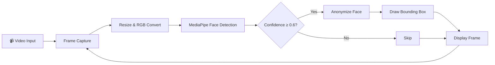

<p align="center">
  
  
  
  
</p>

# 🎭 Face Anonymizer

> **Real-time face detection & anonymization** powered by MediaPipe and OpenCV — protect privacy in videos with a single command.

<p align="center">
  
  
</p>

---

## 📖 Overview

**Face Anonymizer** is a lightweight Python tool that detects faces in video streams and anonymizes them in real-time. It leverages **Google's MediaPipe** for fast, accurate face detection and **OpenCV** for video processing and rendering. Whether you're working with surveillance footage, vlogs, or any video content — this tool ensures privacy compliance with minimal setup.

---

## ✨ Features

| Feature                      | Description                                                      |
| ---------------------------- | ---------------------------------------------------------------- |
| 🔍 **Real-Time Detection**    | Blazing-fast face detection using MediaPipe's short-range model  |
| 🖤 **Black-out**              | Replace detected faces with a solid black mask                   |
| 🌀 **Gaussian Blur**          | Apply a heavy Gaussian blur to obscure facial features           |
| 🟩 **Pixelation**             | Pixelate faces for a classic anonymization look                  |
| 📊 **Confidence Scores**      | Display detection confidence on each bounding box                |
| 🎯 **Configurable Threshold** | Filter detections by a minimum confidence score (default: `0.6`) |
| ⌨️ **ESC to Exit**            | Gracefully stop processing with a single key press               |

---

## 🏗️ Project Structure

```
Face Anonymizer/
├── main.py              # Entry point — video capture, detection loop, rendering
├── utils.py             # Utility functions — bbox conversion, anonymization, drawing
├── requirements.txt     # Python dependencies
├── Test Data/           # Directory containing test videos
│   └── test video.mp4   # Sample input video
├── LICENSE              # MIT License
└── README.md            # This file
```

---

## 🔧 Architecture



### Module Breakdown

#### `main.py`
- Captures video frames from a file using OpenCV
- Resizes each frame to `640×480` for consistent processing
- Runs MediaPipe face detection and filters results by confidence
- Applies anonymization and bounding box overlay
- Displays output and listens for `ESC` key to exit

#### `utils.py`
Contains three core utility functions:

| Function              | Purpose                                                                                   |
| --------------------- | ----------------------------------------------------------------------------------------- |
| `get_bbox_pixels()`   | Converts MediaPipe's relative bounding box to absolute pixel coordinates with clamping    |
| `anonymize_face()`    | Applies the chosen anonymization method (`black`, `blur`, or `pixelate`) to a face region |
| `draw_bounding_box()` | Draws a green rectangle and confidence label around each detected face                    |

---

## 🚀 Getting Started

### Prerequisites

- **Python 3.8+** installed on your system
- A working webcam *(optional — a sample video is included)*

### Installation

1. **Clone the repository**
   ```bash
   git clone https://github.com/your-username/face-anonymizer.git
   cd face-anonymizer
   ```

2. **Create a virtual environment** *(recommended)*
   ```bash
   python -m venv venv

   # Windows
   venv\Scripts\activate

   # macOS / Linux
   source venv/bin/activate
   ```

3. **Install dependencies**
   ```bash
   pip install -r requirements.txt
   ```

### Usage

```bash
python main.py
```

> Press **`ESC`** to stop the video and close the window.

---

## ⚙️ Customization

### Change Anonymization Method

In `main.py`, change the `method` parameter:

```python
# Options: "black", "blur", "pixelate"
frame = anonymize_face(frame, xmin, ymin, xmax, ymax, method="blur")
```

| Method       | Visual Effect                        |
| ------------ | ------------------------------------ |
| `"black"`    | Solid black rectangle over the face  |
| `"blur"`     | Heavy Gaussian blur (51×51 kernel)   |
| `"pixelate"` | Downscale to 16×16 then upscale back |

### Change Input Video

In `main.py`, update the video path:

```python
video_path = './Test Data/test video.mp4'
```

> 💡 **Tip:** Set `video_path = 0` to use your webcam as the live input source.

### Adjust Detection Sensitivity

In `main.py`, adjust the MediaPipe detection confidence threshold:

```python
# MediaPipe minimum detection confidence
min_detection_confidence=0.6
```

---

## 📦 Dependencies

| Package         | Version            | Purpose                                  |
| --------------- | ------------------ | ---------------------------------------- |
| `opencv-python` | 4.13.0.92          | Video capture, image processing, display |
| `mediapipe`     | 0.10.8             | Face detection model                     |
| `numpy`         | *(auto-installed)* | Array operations                         |

---

## 🤝 Contributing

Contributions are welcome! Here are some ideas:

- [ ] Add support for **webcam input** via CLI argument
- [ ] Implement **video file output** (save anonymized video)
- [ ] Add more anonymization methods (emoji overlay, mosaic, etc.)
- [ ] Build a **CLI interface** with `argparse` for all options
- [ ] Add **multi-face tracking** for smoother anonymization

1. Fork the repository
2. Create your feature branch (`git checkout -b feature/amazing-feature`)
3. Commit your changes (`git commit -m 'Add amazing feature'`)
4. Push to the branch (`git push origin feature/amazing-feature`)
5. Open a Pull Request

---

## 📄 License

This project is licensed under the **MIT License** — see the [LICENSE](LICENSE) file for details.

---

<p align="center">
  Made with ❤️ using Python, OpenCV & MediaPipe
</p>
